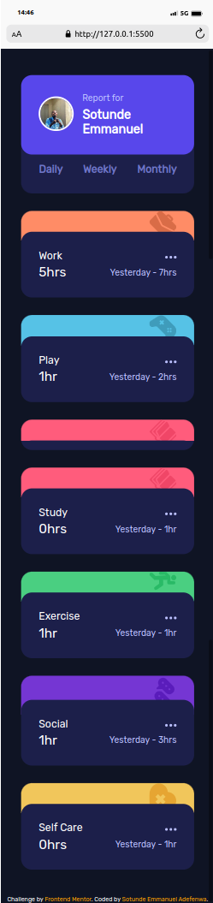
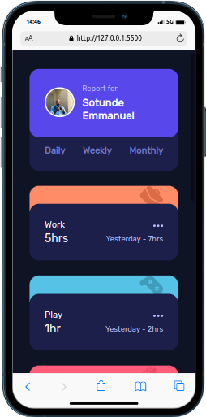
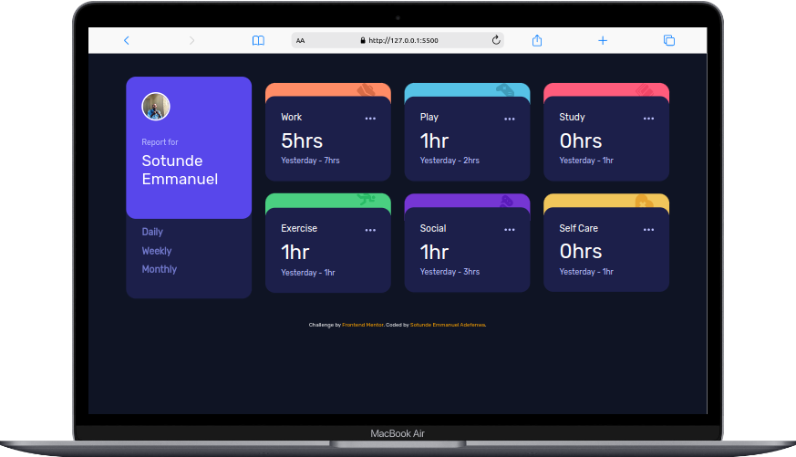

# Frontend Mentor - Time tracking dashboard solution

This is a solution to the [Time tracking dashboard challenge on Frontend Mentor](https://www.frontendmentor.io/challenges/time-tracking-dashboard-UIQ7167Jw). Frontend Mentor challenges help you improve your coding skills by building realistic projects. 

## Table of contents

- [Overview](#overview)
  - [The challenge](#the-challenge)
  - [Screenshot](#screenshot)
  - [Links](#links)
- [My process](#my-process)
  - [Built with](#built-with)
  - [What I learned](#what-i-learned)
  - [Continued development](#continued-development)
- [Author](#author)
- [Acknowledgments](#acknowledgments)

## Overview

### The challenge

Users should be able to:

- View the optimal layout for the site depending on their device's screen size
- See hover states for all interactive elements on the page
- Switch between viewing Daily, Weekly, and Monthly stats

### Screenshot

### Links

- Solution URL: [Manuelcoder02](https://www.frontendmentor.io/solutions/time-tracker-tfYIjLmZ7v)
- Live Site URL: [Time Tracker](https://time-tracking-juniordev.vercel.app/m)

## My process

### Built with

- Semantic HTML5 markup
- CSS custom properties
- Flexbox
- CSS Grid
- Mobile-first workflow
- Javascript

### What I learned

I learnt how to use CSS Grid to create a flexible and responsible layout.

### Continued development

CSS Grid
The a:link, a:visited.

## Author

- Frontend Mentor - [Manuelcoder02](https://www.frontendmentor.io/profile/Manuelcoder02)
- Twitter - [juniorDev @sotundenuel](https://www.twitter.com/@sotundenuel)
- GitHub - [Manuel codes](https://github.com/Manuelcoder02)

## Acknowledgments

Hat tip to myself for being able to complete this project
